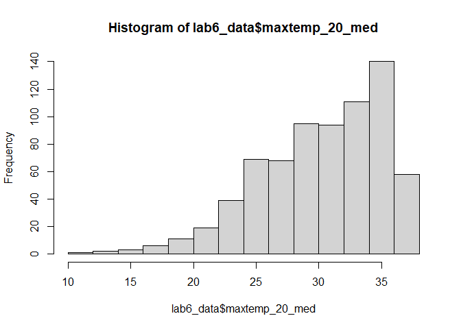

Geog6300: Lab 6
================

## Regression

``` r
library(sf)
library(tidyverse)
library(tmap)
library(car)
library(lmtest)
library(knitr)
```

**Overview:** This lab focuses on regression techniques. You’ll be
analyzing the association of various physical and climatological
characteristics in Australia with observations of several animals
recorded on the citizen science app iNaturalist.

\###Data and research questions###

Let’s import the dataset.

``` r
lab6_data<-st_read("data/aus_climate_inat.gpkg")
```

    ## Reading layer `aus_climate_inat' from data source 
    ##   `C:\Users\clare\Downloads\DataScienceLabs\geog4-6300-lab-6-ClarenceJb\data\aus_climate_inat.gpkg' 
    ##   using driver `GPKG'
    ## Simple feature collection with 716 features and 22 fields
    ## Geometry type: POLYGON
    ## Dimension:     XY
    ## Bounding box:  xmin: 113.875 ymin: -43.38632 xmax: 153.375 ymax: -11.92074
    ## Geodetic CRS:  WGS 84 (CRS84)

The dataset for this lab is a 1 decimal degree hexagon grid that has
aggregate statistics for a number of variables:

- ndvi: NDVI/vegetation index values from Landsat data (via Google Earth
  Engine). These values range from -1 to 1, with higher values
  indicating more vegetation.
- maxtemp_00/20_med: Median maximum temperature (C) in 2000 or 2020
  (data from SILO/Queensland government)
- mintemp_00/20_med: Median minimum temperature (C) in 2020 or 2020
  (data from SILO/Queensland government)
- rain_00/20_sum: Total rainfall (mm) in 2000 or 2020 (data from
  SILO/Queensland government)
- pop_00/20: Total population in 2000 or 2020 (data from NASA’s Gridded
  Population of the World)
- water_00/20_pct: Percentage of land covered by water at some point
  during the year in 2000 or 2020
- elev_med: Median elevation (meters) (data from the Shuttle Radar
  Topography Mission/NASA)

There are also observation counts from iNaturalist for several
distinctively Australian animal species: the central bearded dragon, the
common emu, the red kangaroo, the agile wallaby, the laughing
kookaburra, the wombat, the koala, and the platypus.

Our primary research question is how the climatological/physical
variables in our dataset are predictive of the NDVI value. We will build
models for 2020 as well as the change from 2000 to 2020. The second is
referred to as a “first difference” model and can sometimes be more
useful for identifying causal mechanisms.

\###Part 1: Analysis of 2020 data###

We will start by looking at data for 2020.

**Question 1** *Create histograms for NDVI, max temp., min temp., rain,
and population, and water in 2020 as well as elevation. Based on these
graphs, assess the normality of these variables.*

``` r
hist(lab6_data$ndvi_20_med, na.rm = TRUE)
```

    ## Warning in plot.window(xlim, ylim, "", ...): "na.rm" is not a graphical
    ## parameter

    ## Warning in title(main = main, sub = sub, xlab = xlab, ylab = ylab, ...):
    ## "na.rm" is not a graphical parameter

    ## Warning in axis(1, ...): "na.rm" is not a graphical parameter

    ## Warning in axis(2, at = yt, ...): "na.rm" is not a graphical parameter

<!-- -->

``` r
hist(lab6_data$maxtemp_20_med, na.rm = TRUE)
```

    ## Warning in plot.window(xlim, ylim, "", ...): "na.rm" is not a graphical
    ## parameter

    ## Warning in title(main = main, sub = sub, xlab = xlab, ylab = ylab, ...):
    ## "na.rm" is not a graphical parameter

    ## Warning in axis(1, ...): "na.rm" is not a graphical parameter

    ## Warning in axis(2, at = yt, ...): "na.rm" is not a graphical parameter

<!-- -->

``` r
hist(lab6_data$mintemp_20_med, na.rm = TRUE)
```

    ## Warning in plot.window(xlim, ylim, "", ...): "na.rm" is not a graphical
    ## parameter

    ## Warning in title(main = main, sub = sub, xlab = xlab, ylab = ylab, ...):
    ## "na.rm" is not a graphical parameter

    ## Warning in axis(1, ...): "na.rm" is not a graphical parameter

    ## Warning in axis(2, at = yt, ...): "na.rm" is not a graphical parameter

<!-- -->

``` r
hist(lab6_data$rain_20_sum, na.rm = TRUE)
```

    ## Warning in plot.window(xlim, ylim, "", ...): "na.rm" is not a graphical
    ## parameter

    ## Warning in title(main = main, sub = sub, xlab = xlab, ylab = ylab, ...):
    ## "na.rm" is not a graphical parameter

    ## Warning in axis(1, ...): "na.rm" is not a graphical parameter

    ## Warning in axis(2, at = yt, ...): "na.rm" is not a graphical parameter

<!-- -->

``` r
hist(lab6_data$pop_20, na.rm = TRUE)
```

    ## Warning in plot.window(xlim, ylim, "", ...): "na.rm" is not a graphical
    ## parameter

    ## Warning in title(main = main, sub = sub, xlab = xlab, ylab = ylab, ...):
    ## "na.rm" is not a graphical parameter

    ## Warning in axis(1, ...): "na.rm" is not a graphical parameter

    ## Warning in axis(2, at = yt, ...): "na.rm" is not a graphical parameter

<!-- -->

``` r
hist(lab6_data$water_20_pct, na.rm = TRUE)
```

    ## Warning in plot.window(xlim, ylim, "", ...): "na.rm" is not a graphical
    ## parameter

    ## Warning in title(main = main, sub = sub, xlab = xlab, ylab = ylab, ...):
    ## "na.rm" is not a graphical parameter

    ## Warning in axis(1, ...): "na.rm" is not a graphical parameter

    ## Warning in axis(2, at = yt, ...): "na.rm" is not a graphical parameter

<!-- -->

``` r
hist(lab6_data$elev_med, na.rm = TRUE)
```

    ## Warning in plot.window(xlim, ylim, "", ...): "na.rm" is not a graphical
    ## parameter

    ## Warning in title(main = main, sub = sub, xlab = xlab, ylab = ylab, ...):
    ## "na.rm" is not a graphical parameter

    ## Warning in axis(1, ...): "na.rm" is not a graphical parameter

    ## Warning in axis(2, at = yt, ...): "na.rm" is not a graphical parameter

<!-- -->

{Each variable is skewed to the left or right with no signs of equal
distribution or normality. }

**Question 2** *Use tmap to map these same variables using Jenks natural
breaks as the classification method. For an extra challenge, use
`tmap_arrange` to plot all maps in a single figure.*

``` r
NDVI_Map <- tm_shape(lab6_data) +
  tm_borders() +
  tm_fill("ndvi_20_med", palette = "RdYlGn", style = "jenks", title = "NDVI (2020)") +
  tm_layout(main.title = "NDVI in 2020") 

NDVI_Map
```

<!-- -->

``` r
MaxTemp <- tm_shape(lab6_data) +
  tm_borders() +
  tm_fill("maxtemp_20_med", palette = "RdYlGn", style = "jenks", title = "Maxtemp (2020)") +
  tm_layout(main.title = "Max Temperature in 2020") 
MaxTemp
```

<!-- -->

``` r
MinTemp <- tm_shape(lab6_data) +
  tm_borders() +
  tm_fill("mintemp_20_med", palette = "RdYlGn", style = "jenks", title = "MinTemp (2020)") +
  tm_layout(main.title = "Minumum Temp in 2020") 
MinTemp
```

<!-- -->

``` r
Rain_Sum <- tm_shape(lab6_data) +
  tm_borders() +
  tm_fill("rain_20_sum", palette = "RdYlGn", style = "jenks", title = "Rain Sum (2020)") +
  tm_layout(main.title = "Rain Sum in 2020") 
Rain_Sum
```

<!-- -->

``` r
Population <- tm_shape(lab6_data) +
  tm_borders() +
  tm_fill("pop_20", palette = "RdYlGn", style = "jenks", title = "Population (2020)") +
  tm_layout(main.title = "Population in 2020") 
Population
```

<!-- -->

``` r
Water_Percentage <- tm_shape(lab6_data) +
  tm_borders() +
  tm_fill("water_20_pct", palette = "RdYlGn", style = "jenks", title = "Water Percentage (2020)") +
  tm_layout(main.title = "Water Percentage in 2020")
Water_Percentage
```

<!-- -->

``` r
Elevation_Median <- tm_shape(lab6_data) +
  tm_borders() +
  tm_fill("elev_med", palette = "RdYlGn", style = "jenks", midpoint = NA, title = "Elevation (2020)") +
  tm_layout(main.title = "Elevation in 2020")
Elevation_Median
```

<!-- -->

``` r
Bearded_Dragon <- tm_shape(lab6_data) +
  tm_borders() +
  tm_fill("Central.Bearded.Dragon", palette = "RdYlGn", style = "jenks",, title = "Bearded Dragon (2020)") +
  tm_layout(main.title = "Bearded Dragon Population in 2020")

Bearded_Dragon
```

<!-- -->

``` r
tmap_arrange(NDVI_Map, MaxTemp, MinTemp, Rain_Sum, Population, Water_Percentage, Elevation_Median, Bearded_Dragon, ncol = 2)
```

<!-- -->

**Question 3** *Based on the maps from question 3, summarise major
patterns you see in the spatial distribution of these data from any of
your variables of interest. How do they appear to be associated with the
NDVI variable?*

{I chose to look at the Bearded Dragon Range as a variable of interest.
Looking at the spatial distributions of each map it shows that Bearded
Dragons live in the cooler parts of austrailia. They also live in the
lower rain sum areas with low elevation and mix of medium vegetation.
The water percentage is also not high. They appear to be associated as I
thought with the NDVI variable. Theres some vegetation but not a lot and
the temperatures are cooler with vegetation and evapotranspiration.
Being reptiles they also need sun and are typically found in almost
desert climates with little rainfall and water and population. }

**Question 4** *Create univariate models for each of the variables
listed in question 1, with NDVI in 2020 as the dependent variable. Print
a summary of each model. Write a summary of those results that indicates
the direction, magnitude, and significance for each model coefficient.*

``` r
model_NDVI_MaxTemp <- lm(ndvi_20_med ~ maxtemp_20_med, data = lab6_data)
model_NDVI_MinTemp <- lm(ndvi_20_med ~ mintemp_20_med, data = lab6_data)
model_NDVI_RainSum <- lm(ndvi_20_med ~ rain_20_sum, data = lab6_data)
model_NDVI_Population <- lm(ndvi_20_med ~ pop_20, data = lab6_data)
model_NDVI_WaterPct <- lm(ndvi_20_med ~ water_20_pct, data = lab6_data)
model_NDVI_Elevation <- lm(ndvi_20_med ~ elev_med, data = lab6_data)

summary(model_NDVI_MaxTemp)
```

    ## 
    ## Call:
    ## lm(formula = ndvi_20_med ~ maxtemp_20_med, data = lab6_data)
    ## 
    ## Residuals:
    ##      Min       1Q   Median       3Q      Max 
    ## -0.41874 -0.07657 -0.01927  0.06833  0.36382 
    ## 
    ## Coefficients:
    ##                  Estimate Std. Error t value Pr(>|t|)    
    ## (Intercept)     0.6612389  0.0294372   22.46   <2e-16 ***
    ## maxtemp_20_med -0.0130902  0.0009601  -13.63   <2e-16 ***
    ## ---
    ## Signif. codes:  0 '***' 0.001 '**' 0.01 '*' 0.05 '.' 0.1 ' ' 1
    ## 
    ## Residual standard error: 0.1251 on 714 degrees of freedom
    ## Multiple R-squared:  0.2066, Adjusted R-squared:  0.2055 
    ## F-statistic: 185.9 on 1 and 714 DF,  p-value: < 2.2e-16

``` r
summary(model_NDVI_MinTemp)
```

    ## 
    ## Call:
    ## lm(formula = ndvi_20_med ~ mintemp_20_med, data = lab6_data)
    ## 
    ## Residuals:
    ##      Min       1Q   Median       3Q      Max 
    ## -0.36375 -0.08418 -0.03047  0.06972  0.40383 
    ## 
    ## Coefficients:
    ##                 Estimate Std. Error t value Pr(>|t|)    
    ## (Intercept)     0.464461   0.018997   24.45   <2e-16 ***
    ## mintemp_20_med -0.012282   0.001131  -10.86   <2e-16 ***
    ## ---
    ## Signif. codes:  0 '***' 0.001 '**' 0.01 '*' 0.05 '.' 0.1 ' ' 1
    ## 
    ## Residual standard error: 0.1301 on 714 degrees of freedom
    ## Multiple R-squared:  0.1418, Adjusted R-squared:  0.1406 
    ## F-statistic:   118 on 1 and 714 DF,  p-value: < 2.2e-16

``` r
summary(model_NDVI_RainSum)
```

    ## 
    ## Call:
    ## lm(formula = ndvi_20_med ~ rain_20_sum, data = lab6_data)
    ## 
    ## Residuals:
    ##      Min       1Q   Median       3Q      Max 
    ## -0.56681 -0.04753 -0.01210  0.04599  0.30930 
    ## 
    ## Coefficients:
    ##              Estimate Std. Error t value Pr(>|t|)    
    ## (Intercept) 1.303e-01  7.060e-03   18.45   <2e-16 ***
    ## rain_20_sum 9.124e-07  3.953e-08   23.08   <2e-16 ***
    ## ---
    ## Signif. codes:  0 '***' 0.001 '**' 0.01 '*' 0.05 '.' 0.1 ' ' 1
    ## 
    ## Residual standard error: 0.1063 on 714 degrees of freedom
    ## Multiple R-squared:  0.4273, Adjusted R-squared:  0.4265 
    ## F-statistic: 532.6 on 1 and 714 DF,  p-value: < 2.2e-16

``` r
summary(model_NDVI_Population)
```

    ## 
    ## Call:
    ## lm(formula = ndvi_20_med ~ pop_20, data = lab6_data)
    ## 
    ## Residuals:
    ##      Min       1Q   Median       3Q      Max 
    ## -0.47003 -0.07883 -0.03949  0.06384  0.48974 
    ## 
    ## Coefficients:
    ##              Estimate Std. Error t value Pr(>|t|)    
    ## (Intercept) 2.552e-01  5.013e-03  50.902   <2e-16 ***
    ## pop_20      1.500e-06  1.500e-07   9.998   <2e-16 ***
    ## ---
    ## Signif. codes:  0 '***' 0.001 '**' 0.01 '*' 0.05 '.' 0.1 ' ' 1
    ## 
    ## Residual standard error: 0.1316 on 714 degrees of freedom
    ## Multiple R-squared:  0.1228, Adjusted R-squared:  0.1216 
    ## F-statistic: 99.97 on 1 and 714 DF,  p-value: < 2.2e-16

``` r
summary(model_NDVI_WaterPct)
```

    ## 
    ## Call:
    ## lm(formula = ndvi_20_med ~ water_20_pct, data = lab6_data)
    ## 
    ## Residuals:
    ##      Min       1Q   Median       3Q      Max 
    ## -0.26898 -0.08838 -0.04838  0.06871  0.50911 
    ## 
    ## Coefficients:
    ##               Estimate Std. Error t value Pr(>|t|)    
    ## (Intercept)   0.268988   0.006287  42.781   <2e-16 ***
    ## water_20_pct -0.178263   0.154480  -1.154    0.249    
    ## ---
    ## Signif. codes:  0 '***' 0.001 '**' 0.01 '*' 0.05 '.' 0.1 ' ' 1
    ## 
    ## Residual standard error: 0.1403 on 714 degrees of freedom
    ## Multiple R-squared:  0.001862,   Adjusted R-squared:  0.0004636 
    ## F-statistic: 1.332 on 1 and 714 DF,  p-value: 0.2489

``` r
summary(model_NDVI_Elevation)
```

    ## 
    ## Call:
    ## lm(formula = ndvi_20_med ~ elev_med, data = lab6_data)
    ## 
    ## Residuals:
    ##      Min       1Q   Median       3Q      Max 
    ## -0.27082 -0.09585 -0.04270  0.07954  0.44272 
    ## 
    ## Coefficients:
    ##              Estimate Std. Error t value Pr(>|t|)    
    ## (Intercept) 2.138e-01  9.741e-03  21.952  < 2e-16 ***
    ## elev_med    1.787e-04  2.895e-05   6.171 1.14e-09 ***
    ## ---
    ## Signif. codes:  0 '***' 0.001 '**' 0.01 '*' 0.05 '.' 0.1 ' ' 1
    ## 
    ## Residual standard error: 0.1369 on 714 degrees of freedom
    ## Multiple R-squared:  0.05064,    Adjusted R-squared:  0.04931 
    ## F-statistic: 38.08 on 1 and 714 DF,  p-value: 1.136e-09

{The MaxTemp model has a negative direction lower temperatures are
associated with lower NDVI values. The Magnitude is -0.13 for every 1
degree Celsius the NDVI is expected to decrease by 0.13. The p-value is
0.0000000000000002 indicating a very small p value indicating there is a
statistical significance in the variables.

The MinTemp model has a negative direction meaning for every 1 degree
Celsius the NDVI is expected to decrease 0.012. The p value is again
super small indicating a statistical significance between lower
temperatures and NDVI.

The RainSum model has a positive direction of 9.124e-07 meaning that as
the total rainfall increases NDVI tends to increase. The p value is \<
2e-16 indicating a significance between the two variables.

The Population model has a positive direction so as the population
increases the NDVI increases a little. The Magnitude is as the
population increases NDVI tends to increase by 1.500e-06.

WaterPercentage model has a negative direction. The magnitude indicates
as the water precentage increases the NDVI decreases about -0.17 and is
moderately negative. The p value of 0.249 which is over 0.05 meaning
there isn’t a statistical significance.

Elevation Med model has a positive direction. The Magnitude is as the
elevation increases the NDVI increases 1.787e-04. The p value of
1.14e-09 indicates that there is a statiscial significance between the
two variables }

**Question 5** *Create a multivariate regression model with the
variables of interest, choosing EITHER max or min temperature (but not
both) You may also choose to leave out any variables that were
insignificant in Q4. Use the univariate models as your guide. Call the
results.*

``` r
multivariate_model <- lm(ndvi_20_med ~ maxtemp_20_med + rain_20_sum + pop_20 + elev_med, data = lab6_data)

summary(multivariate_model)
```

    ## 
    ## Call:
    ## lm(formula = ndvi_20_med ~ maxtemp_20_med + rain_20_sum + pop_20 + 
    ##     elev_med, data = lab6_data)
    ## 
    ## Residuals:
    ##      Min       1Q   Median       3Q      Max 
    ## -0.50217 -0.02838  0.00409  0.03919  0.20570 
    ## 
    ## Coefficients:
    ##                  Estimate Std. Error t value Pr(>|t|)    
    ## (Intercept)     4.571e-01  2.194e-02  20.828  < 2e-16 ***
    ## maxtemp_20_med -1.170e-02  6.796e-04 -17.220  < 2e-16 ***
    ## rain_20_sum     8.469e-07  3.263e-08  25.953  < 2e-16 ***
    ## pop_20          2.862e-07  1.044e-07   2.741  0.00627 ** 
    ## elev_med        1.233e-04  1.796e-05   6.864 1.46e-11 ***
    ## ---
    ## Signif. codes:  0 '***' 0.001 '**' 0.01 '*' 0.05 '.' 0.1 ' ' 1
    ## 
    ## Residual standard error: 0.0845 on 711 degrees of freedom
    ## Multiple R-squared:  0.6397, Adjusted R-squared:  0.6376 
    ## F-statistic: 315.5 on 4 and 711 DF,  p-value: < 2.2e-16

**Question 6** *Summarize the results of the multivariate model. What
are the direction, magnitude, and significance of each coefficient? How
did it change from the univariate models you created in Q4 (if at all)?
What do the R2 and F-statistic values tell you about overall model fit?*

{MaxTemp has a negative direction. The Magnitude is as the temperatures
1 degree NDVI will decrease by -1.170e-02. The p value of 2e-16
indicates a statisitcal significance.

RainSum has a positive direction. The Magnitude is as the rainfall
increase the NDVI is expected to increase 8.469e-07. The p value of
2e-16 indicates a statistical significance in the relationship.

Population has a positive direction. The Magnitude is as the population
increase that NDVI is likely to increase by 2.862e-07. The p value shows
0.00627 whis is below 0.05 and shows a slight significance.

Elevation has a positive direction. The Magnitude is as elevation
increases NDVI is expected to increase 1.233e-04. The p value has a
value of 1.46e-11 indicating a statistical significance }

**Question 7** *Use a histogram and a map to assess the normality of
residuals and any spatial autocorrelation. Summarise any notable
patterns that you see.*

``` r
residuals <- residuals(multivariate_model)

hist(residuals, breaks = 30, main = "Histogram of Residuals",
     xlab = "Residuals", col = "lightblue", border = "black")
```

<!-- -->

``` r
lab6_data$residuals <- residuals

tmap_mode()
```

    ## current tmap mode is "plot"

``` r
residual_map <- tm_shape(lab6_data) +
  tm_borders() +
  tm_fill("residuals", palette = "-RdBu", midpoint = NA, style = "cont", title = "Residuals") +
  tm_layout(main.title = "Map of Residuals")
residual_map
```

<!-- -->

{Just based on spatial and looking with the eye a lot fo the negative
correlations are near the coastal regions of Austrailia and The positive
correlations appear to be clustered more inland with the a few coastal
exceptions. }

**Question 8** *Assess any issues with multicollinearity or
heteroskedastity in this model using the techniques shown in class. Run
the appropriate tests and explain what their results show you.*

``` r
vif(multivariate_model)
```

    ## maxtemp_20_med    rain_20_sum         pop_20       elev_med 
    ##       1.098705       1.078449       1.173863       1.009305

``` r
bptest(multivariate_model)
```

    ## 
    ##  studentized Breusch-Pagan test
    ## 
    ## data:  multivariate_model
    ## BP = 122.21, df = 4, p-value < 2.2e-16

{The Vif test shows there is no multicollinearity. The values are below
5 and 10 thresholds.

The bptest function indicates that heteroskedasticity is present in the
dataset. The p value is small enough for us to believe that the
residuals are not constant across all the levels of the independent
variables. }

**Question 9** *How would you summarise the results of this model in a
sentence or two? In addition, looking at the full model and your
diagnostics, do you feel this is a model that provides meaningful
results? Explain your answer.*

{ The model showcases the influences of multiple variables have on a
common dependent variable being NDVI, To asses sthe habitat range of
species based on different variables. I do not believe the model
showcases meanignful results. The data doesn’t necessarily show much
significance well I believe.}

**Disclosure of assistance:** *Besides class materials, what other
sources of assistance did you use while completing this lab? These can
include input from classmates, relevant material identified through web
searches (e.g., Stack Overflow), or assistance from ChatGPT or other AI
tools. How did these sources support your own learning in completing
this lab?*

{I had help from peers and ChatGPT. My peers helped me understand some
of the things I missed in class through notes. ChatGPT helped assessed
common errors in my code. I also used Google to look at definitons and
basic R syntax for certain functions}

**Lab reflection:** *How do you feel about the work you did on this lab?
Was it easy, moderate, or hard? What were the biggest things you learned
by completing it?*

{I think it was moderate the most confusing part is just trying to make
sure oyu understand the numbers that result from the various test.}

**Challenge question**

\#Option 1 Create a first difference model. To do that, subtract the
values in 2000 from the values in 2020 for each variable for which that
is appropriate. Then create a new model similar to the one you created
in question 5, but using these new variables showing the *change in
values* over time. Call the results of the model, and interpret the
results in the same ways you did above. Also chart and map the residuals
to assess model error. Finally, write a short section that summarises
what, if anything, this model tells you.

\#Option 2 The animal data included in this dataset is an example of
count data, and usually we would use a Poisson or similar model for that
purpose. Let’s try it with regular OLS regression though. Create two
regression models to assess how the counts of two different animals
(say, koalas and emus) are associated with at least three of the
environmental/climatological variables given above. Be sure to use the
same independent variables in each model. Interpret the results of each
model and then explain the importance of any differences in the model
coefficients between them, focusing on direction, magnitude, and
significance.
